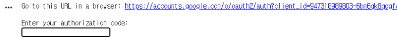
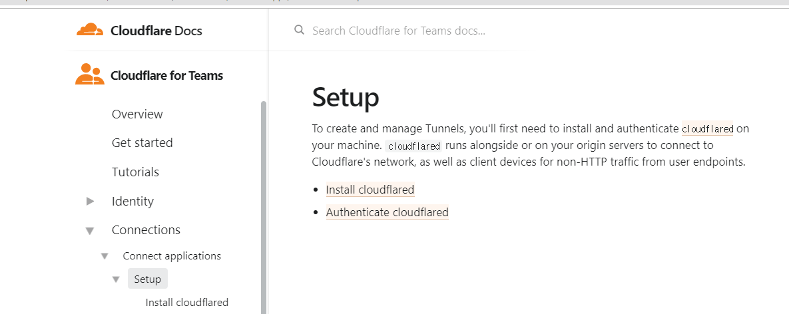
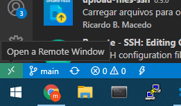
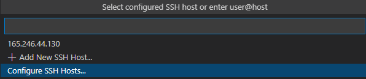
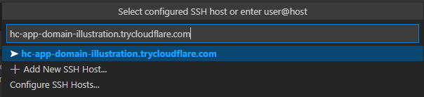

**Link Colab to VScode**

**-This is method for connecting Colab to VScode-**

**1. Run code below**

-   You can result like this

{: width="100%" height="100%"}

-   Go to link and get authorization code

-   Copy it and paste it to blank

**2. Download Cloudflared**

-   Wait for downloading some utilities, and you can get result like this

-   Go to the link “Cloudflared (Argo Tunnel)”

-   Click “Install cloudflared”, and download file for your OS

-   Unzip the file and save it wherever you want

**3. VScode setting**

-   Open VScode and download “Remote-SSH” extension

-   And “Open a Remote Window”

-   Click “Connect to Host…”

-   Click “Configure SSH Hosts…” and click your config

-   The config will like this “C:\\Users\\Username\\.ssh\\config”

-   You will get this config file

**4. adding Host**

-   Go to Colab and copy this config info

-   Paste it to VScode config

-   Modify the ProxyCommand part to the location of the saved Cloudflared file

-   Save it!

**5. Connect to Colab**

-   From Colab copy “VSCode Remote SSH”

-   Again, VScode-“Open remote Window”-“Connect to Host”

-   paste it

**6. Remote Connection**

-   With opening new window, Some options are there

-   First, Select Linux

-   and if there can be option asking “Continue”, just click “Continue”

-   Second, Enter password

-   It will “test” as default

-   Now, we just finished coneection!

-   Enjoy coding on VSCode with Colab
